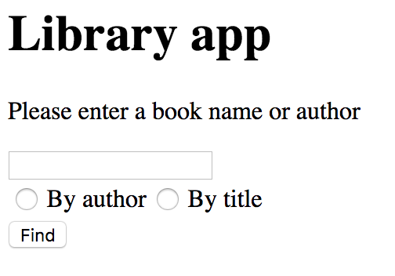

# Getting started with Java EE

This is the first practical example of EJB series published on [halfastack.com](www.halfastack.com) aimed at
developers with little to none experience with JEE.

Technologies used in this project:

- EJB
- CDI
- Faces for frontend



The app is very simple and with no styling to make it easy for newcomers. We will enhance the app later on.

## Target Audience

The target audience is you. I have no requirements, everything here is free and readily available to everyone.
If you cannot understand code here, you can read my articles on JPA:

* [EJB theoretical part](https://www.halfastack.com/java-ee-ejb-beans-i-introduction/)
* [EJB code walkthrough](https://www.halfastack.com/java-ee-ejb-beans-ii-code-walkthrough/)

I will be very glad for any comments that you have.

## Getting Started

### Prerequisites

You will need:

1. A database server
2. An application server
3. Maven

If you have no application server or Maven, check out my [Getting Started](https://www.halfastack.com/java-ee-series-getting-started/) article.

### Deploying

In a command line, change into this project such that when you issue `ls` (or `DIR` on Windows), you see `pom.xml` among other files.
Then, issue the following command:

```
mvn clean package
```

With that, you will create the `target` directory. Copy the resulting `EJB_I.war` into your application server's deploy directory
and access `localhost:8080/EJB_I` (if your server runs on a different address or port, please change accordingly). See the [EJB code walkthrough](https://www.halfastack.com/java-ee-ejb-beans-ii-code-walkthrough/) for step-by-step information on deployment.

## Authors

* **Marek Czernek** - [halfastack author](www.halfastack.com)
